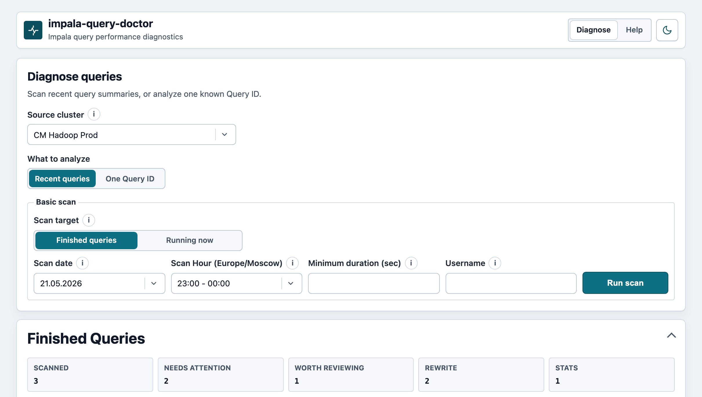
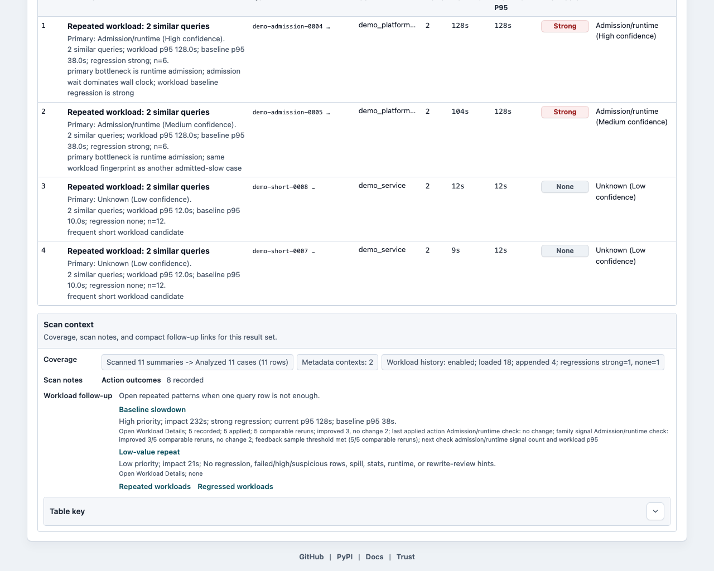
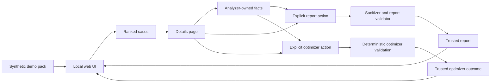

# Query Doctor

Last reviewed: 2026-05-28

Language: English | [Russian](README.ru.md)

[](https://github.com/alexandrefimov/Query-Doctor/actions/workflows/ci.yml)
[](https://github.com/alexandrefimov/Query-Doctor/actions/workflows/package.yml)
[](https://github.com/alexandrefimov/Query-Doctor/actions/workflows/docs.yml)
[](https://github.com/alexandrefimov/Query-Doctor/actions/workflows/codeql.yml)
[](https://pypi.org/project/query-doctor/)

Query Doctor is a local-first Big Data query diagnostic tool focused today on
Apache Impala production triage. It helps operators rank suspicious Recent
queries, collect bounded profile context, derive deterministic evidence,
optionally enrich that evidence with safe metadata, and generate validated
human-readable reports without exposing raw SQL or raw profiles in trusted
UI/report surfaces.

It runs near the operator's own credentials, collects bounded read-only context
from Cloudera Manager or direct Impala daemon endpoints, extracts deterministic
facts in Python, and can generate validated reports without treating an LLM as a
source of truth. The global `language` config controls Help, Details static UI
copy, and newly generated trusted reports; Russian output uses the same
language-specific prompt, normalizer, and validator boundary.

Core rule:

```text
Python owns facts. LLM owns wording only.
```

Recent scan is the flagship workflow. Query ID diagnosis is secondary for one
known Impala query. Query Optimizer is separate, read-only, and does not execute
or echo submitted SQL. Report generation uses LLMs only for wording from
Python-owned facts.

Facts first. Drama never.

## What Query Doctor Is / Is Not

Query Doctor is:

- a local-first Impala production triage workbench;
- a deterministic evidence extractor;
- a Recent-query ranking workflow for operators and administrators;
- a safe report generator using validated facts;
- a practical tool for deciding what to inspect, change, and verify next;
- a Big Data SQL/lakehouse diagnostics wedge whose implemented engine is
  Apache Impala today.

Query Doctor is not:

- a generic AI chatbot over raw profiles;
- a replacement for the Impala Web UI;
- a tool that executes user SQL or optimizer draft SQL;
- a tool that sends raw SQL/profile data to remote services by default;
- a root-cause oracle;
- multi-engine today.

## What It Does

- Scans completed Recent queries as the primary workflow, with Running queries
  and one explicit Known Query ID as focused secondary modes for Apache Impala.
- Works with Cloudera Manager when available, or with direct Impala daemon
  profile/query-list endpoints for vanilla, Ambari-style, or otherwise
  non-Cloudera-Manager clusters.
- Direct Impala profile collection keeps text endpoints as the default
  compatibility path; JSON profile probing is opt-in and falls back to text for
  older Impala versions. Analyzer facts record only safe capability summaries
  such as the selected endpoint format and probe status.
- Direct Impala can also opt in to a bounded `/profile_docs/?json`
  counter-stability probe with `/profile_docs` HTML fallback. Query Doctor
  stores only a safe allowlisted registry context, not raw counter
  documentation.
- Direct Impala can opt in to bounded `/admission?json` aggregate context.
  Missing older endpoints are non-fatal, and the analyzer treats the result as
  context-only unless selected-query admission wait/result evidence exists.
- Optionally collects bounded Prometheus runtime metric summaries for direct
  Impala workflows and bounded read-only Impala metadata through `impala-shell`.
- Ranks suspicious cases and action candidates from deterministic analyzer
  facts, not LLM scoring.
- Generates trusted reports only after deterministic normalization,
  sanitization, and validation.
- Provides a separate read-only Query Optimizer workflow for pasted SQL review,
  plus an explicit details-page optimizer action for server-owned analyzed
  cases.
- Keeps raw SQL, raw profiles, raw metadata, local paths, secrets, subprocess
  output, model/runtime internals, and raw artifact filenames out of browser and
  trusted report surfaces.

## Supported Scope

| Area | Supported today | Not current support |
| --- | --- | --- |
| Query engine | Apache Impala | Other engines are roadmap seams only. |
| Trino private preview | Closed test-cluster smoke and sanitized evidence-package artifacts for maintainers | Public Trino engine support, live collection, browser/report output, optimizer behavior, or Query Doctor-generated SQL. |
| Cloudera Manager | Full Recent discovery/profile/metrics/events context for Impala workflows | Generic cluster diagnosis beyond the Query Doctor flow. |
| Direct Impala | Bounded Recent scans, Running scans, and one Known Query ID through impalad daemon endpoints | Cloudera Manager events, broad log scraping, or SQL execution. |
| Runtime metrics | Optional bounded Prometheus summaries for configured direct Impala workflows | Raw time-series output or arbitrary PromQL from users. |
| Metadata | Read-only allowlisted metadata statements through `impala-shell` | User SQL execution or unbounded metadata crawling. |
| Reports and optimizer | Python-owned facts, validation, and explicit selected-case actions | LLM output as trusted evidence or automatic batch LLM jobs. |

Future Big Data SQL/lakehouse engines, broader providers, prepared event/log
sources, and Cluster Doctor workflows remain roadmap seams, not current support.
Trino private-preview artifacts are closed test-cluster groundwork only; see
[docs/engines/trino-private-preview-release.md](docs/engines/trino-private-preview-release.md).

Apache Impala also has upstream work around native AI query profile analysis.
Query Doctor aligns with that direction by staying focused on local-first
production triage across many queries, deterministic evidence, safe enrichment,
and validated raw-free reports. See
[docs/upstream-impala-ai-analyzer.md](docs/upstream-impala-ai-analyzer.md).

## Install

Install the current public package from PyPI:

```bash
python3 -m venv .venv
. .venv/bin/activate
python -m pip install --upgrade pip
python -m pip install query-doctor
```

For local development from a checkout, use an editable install:

```bash
python3 -m venv .venv
. .venv/bin/activate
python -m pip install --upgrade pip
python -m pip install -e .
```

For contributor tooling, install the development extra:

```bash
python -m pip install -e ".[dev]"
pre-commit install
```

In a network-restricted environment, install from a prebuilt wheel or make sure
the build dependencies are already present locally, then install the checkout:

```bash
python -m pip install .
```

Local JSON configuration is documented in [docs/configuration.md](docs/configuration.md).
The preferred workstation path is `~/.qdcreds/query-doctor-config.json`;
secrets still stay in environment variables or local env files.

## Quickstart Smoke

Run the deterministic local checks first. They do not call Cloudera Manager,
Impala, Ollama, or the network:

```bash
query-doctor-demo-preflight
DEMO_PACK="${TMPDIR:-/tmp}/query-doctor-demo-pack"
query-doctor-demo --out "$DEMO_PACK" --overwrite
QUERY_DOCTOR_ACTION_OUTCOMES_PATH="$DEMO_PACK/action_outcomes.jsonl" \
  query-doctor-web --host 127.0.0.1 --port 8766 --batch-summary "$DEMO_PACK/batch_summary.json"
```

Open the localhost URL printed by `query-doctor-web`. The synthetic demo pack is
local-only and contains no real SQL, profiles, metadata, hostnames, users, or
credentials. Start with
`/?query_group=workloads#workload-action-queue` to show the workload action
queue and local synthetic action outcomes before drilling into individual
cases.

The local web UI starts with a bounded search form and renders synthetic
Finished Queries results for review:





The current `0.4.2` release-candidate synthetic demo pack contains eleven
sanitized cases. Use it to inspect:

- Workloads and Action Queue entries for repeated, regressed, and
  admission/runtime-sensitive query groups;
- optimizer recommendations that stay trusted only after deterministic
  validation;
- a statistics-maintenance candidate backed by collected metadata;
- storage/HDFS, frequent-short, mixed-signal, unknown, and direct-Impala
  compatibility stories.

See [docs/demo-cases.md](docs/demo-cases.md) for the full scenario list and
talk track.

The synthetic demo follows the same safety shape as real local workflows:



## Console Scripts

After installation, use the packaged entry points:

```bash
query-doctor-analyze --help
query-doctor-batch-recent --help
query-doctor-cleanup-generated --help
query-doctor-cm-events --help
query-doctor-cm-sample-smoke --help
query-doctor-collect-cm-profiles --help
query-doctor-collect-impala-context --help
query-doctor-collect-impala-profile --help
query-doctor-corpus-smoke --help
query-doctor-demo --help
query-doctor-demo-preflight --help
query-doctor-optimize-query --help
query-doctor-pipeline --help
query-doctor-report --help
query-doctor-web --help
```

Root-level compatibility launchers have been removed. Use the `query-doctor-*`
commands, or `python -m query_doctor.cli.<command_module>` when running directly
from a checkout without installing console scripts.

## Main Workflows

### Web UI

```bash
query-doctor-web --help
```

The local web UI exposes:

- `Diagnose`: the primary screen for Recent Scan triage across many queries.
  `Finished queries` is the default target; `Running now` is available as
  lower-confidence live context.
- `Known Query ID`: a secondary mode inside `Diagnose` for one explicit Impala
  query ID. It uses Cloudera Manager by default or direct Impala daemon profile
  endpoints when `cluster_type=impala` is configured.
- Details pages with deterministic findings, evidence context, an explicit
  Python Report baseline, optional LLM narrative, and Query LLM optimizer
  actions.
- `Help`: curated in-product workflow, safety, and documentation guidance.

The pasted-SQL `Query Optimizer` remains a read-only compatibility route and
test surface. It does not execute SQL and does not echo submitted SQL after
submit, but it is not promoted as a primary navigation item while profile-backed
diagnosis is the main product workflow.

Validated reports and details-page optimizer drafts are generated only by
explicit user action for selected cases.

### CLI And Headless Use

The packaged CLI entry points cover analyzer runs, batch Recent scans, profile
collection, metadata collection, reports, optimizer review, demo generation, and
cleanup. They are intended for local diagnosis, automation in a controlled
environment, and CI-style smoke checks.

For team workflows, prefer a pinned project version and shared conventions such
as a reports repository, scheduled headless scans under a controlled service
account, a team jumpbox, or a shared local LLM endpoint. Query Doctor itself
remains local-first and single-user unless a future shared-deploy design adds
authentication, authorization, tenant/job isolation, audit logging, TLS trust,
and resource limits.

### Analyzer

```bash
query-doctor-analyze CASE_DIR
```

The analyzer reads collected local case files and writes deterministic facts.
It does not call Cloudera Manager, Impala, Ollama, or the report writer.

### Pipeline

```bash
query-doctor-pipeline CASE_DIR --stop-after-analysis
```

Pipeline mode runs analyzer-first, can optionally collect bounded metadata when
configured, and generates reports only when requested.

### Query Optimizer

```bash
query-doctor-optimize-query --help
```

The Query Optimizer accepts one safe read-only `SELECT` or `WITH` statement for
analysis. It never executes SQL, never echoes pasted SQL back after submit, and
trusts SQL drafts only when Python-owned recipes and validation prove the
supported transform.

### Cloudera Manager (CM) Events And Cluster Context

```bash
query-doctor-cm-events --help
```

The CM Events CLI is a read-only Cluster Doctor seam for Cloudera Manager event
summaries. It can write normalized event summaries plus schema-versioned
raw-free `cluster_event_context.json` and `cluster_context.json` artifacts.
Recent scan can also collect one bounded Cluster Event Context from Cloudera
Manager Events per scan window and show only raw-free cluster context status in
the web UI. These artifacts are not yet a Cluster Doctor web workflow or report
path.

### Demo Preflight

```bash
query-doctor-demo-preflight
```

The demo preflight is deterministic and local. It checks git hygiene,
safety-sensitive changed areas, browser/trusted-output denylist patterns, and
focused test suggestions without LLM, network, Cloudera Manager, or Impala
access.

## Supported Deployment

Query Doctor is supported as a single-user, local-first tool run by an operator
with their own local Cloudera Manager, Kerberos, Impala, Prometheus, and LLM
credentials. Use localhost or a tightly controlled local bind for the web UI.

Do not deploy the current web UI as a shared service for a team or company.
Shared deployments need a separate design for authentication, authorization,
tenant/job isolation, audit logging, TLS/reverse-proxy trust, and resource
limits before they are supported.

## Why Not A Chat Wrapper?

Query Doctor is built for operational diagnostics, where unsupported certainty
is worse than saying "unknown." A chat wrapper over raw profiles would make it
too easy for model wording to become accidental evidence.

Instead:

- collectors gather bounded, read-only, redacted inputs;
- analyzers extract deterministic facts;
- reports use LLMs only to phrase those facts;
- validators reject unsupported claims and unsafe output;
- browser surfaces show trusted summaries, not raw operational artifacts.

## Safety Model

- Python/analyzer-owned facts are the only trusted diagnostic evidence.
- Raw LLM output is untrusted unless normalized, sanitized, and validated.
- Browser-visible UI and trusted reports must not expose raw SQL, raw profiles,
  raw metadata, local paths, secrets, subprocess output, model/runtime internals,
  or raw artifact filenames.
- External collection must be explicit, bounded, read-only, redacted, and safe
  by default.
- Local config `privacy_mode` defaults to `true`; disabling it can relax local
  artifact identifier/host masking, but browser-visible UI and trusted reports
  still do not show raw SQL, profiles, or metadata. Local config `no_llm=true`
  keeps report and optimizer actions on deterministic Python-owned output.
- Impala metadata collection is allowlisted and read-only.
- Query Optimizer accepts only a single safe read-only statement and never
  executes pasted SQL.

See [docs/safety-contract.md](docs/safety-contract.md) for the full contract.
For a public, reviewer-oriented overview, see
[docs/security-model.md](docs/security-model.md).

## Licensing

Query Doctor is licensed under the Apache License, Version 2.0
(`Apache-2.0`). See [LICENSE](LICENSE).

Apache, Apache Impala, and Impala are trademarks of The Apache Software
Foundation. Query Doctor is an independent project and is not endorsed by The
Apache Software Foundation or the Apache Impala project.

## Documentation

Start with [docs/README.md](docs/README.md). It separates current user docs,
operations guides, architecture contracts, current audit docs, and supporting
references.

The canonical documentation language is English. The main Russian companion
README is [README.ru.md](README.ru.md). Additional Russian localized companion
pages live under [docs/i18n/ru/](docs/i18n/ru/) when they are useful for long
operator-facing explanations. If English and Russian pages diverge, the English
page is the source of truth until the localized companion is updated.

Public demo and release paths:

- [docs/demo-mode.md](docs/demo-mode.md): synthetic demo pack generation and
  README screenshot refresh path.
- [docs/DEMO.md](docs/DEMO.md): localhost UI demo runbook and talk track.
- [docs/demo-cases.md](docs/demo-cases.md): sanitized public demo scenarios.
- [docs/demo-preflight.md](docs/demo-preflight.md): deterministic demo and
  public-release guard.
- [docs/public-release-readiness.md](docs/public-release-readiness.md): public
  release readiness checklist.
- [docs/release-notes-0.4.2.md](docs/release-notes-0.4.2.md): curated 0.4.2
  release notes for the public release baseline.
- [docs/release-notes-0.4.1.md](docs/release-notes-0.4.1.md): curated 0.4.1
  release notes for the synthetic demo update.
- [docs/release-checklist.md](docs/release-checklist.md): final tag,
  package-index, and visibility-change checklist.

High-value references:

- [docs/local-smoke.md](docs/local-smoke.md): local validation and smoke checks.
- [docs/credentials.md](docs/credentials.md): local credentials layout.
- [docs/repository-hardening.md](docs/repository-hardening.md): repository
  security, CI hardening, release automation, and strong-test backlog.
- [docs/architecture.md](docs/architecture.md): current and future component
  boundary diagrams.
- [docs/upstream-impala-ai-analyzer.md](docs/upstream-impala-ai-analyzer.md):
  alignment with Apache Impala's native AI profile-analysis direction.
- [docs/contributor-architecture.md](docs/contributor-architecture.md):
  contributor-oriented architecture map.
- [docs/roadmap.md](docs/roadmap.md): implemented scope and planned seams.
- [docs/query-optimizer-contract.md](docs/query-optimizer-contract.md):
  optimizer trust boundary.
- [docs/cluster-doctor-contract.md](docs/cluster-doctor-contract.md): future
  Cluster Doctor contract.

## Development Checks

Before committing:

```bash
pre-commit run --all-files
scripts/local_gate.sh
python -m ruff check query_doctor tests
python -m ruff format --check query_doctor tests scripts
python3 -m pytest -q
git diff --check
query-doctor-demo-preflight
git status --short
```

Stage only explicit files. Do not commit generated cases, reports, local
configs, credentials, raw profiles, raw metadata, or temporary outputs.

## Public Status

This repository is public. Public source releases start at `v0.4.2`. Older
package-index releases remain visible on
[query-doctor on PyPI](https://pypi.org/project/query-doctor/) where needed for
installed-artifact history. The public license is Apache-2.0.

PyPI publishing uses GitHub OIDC Trusted Publishing. The repository-side
`testpypi` and `pypi` environments require maintainer approval and do not use
stored package-index API tokens.

Before cutting a new tag, publishing to a package index, or announcing a public
release, run the public-release guard from a clean working tree:

```bash
query-doctor-demo-preflight --public-release
```

Use [docs/release-checklist.md](docs/release-checklist.md) for the full release
and visibility-change checklist.
