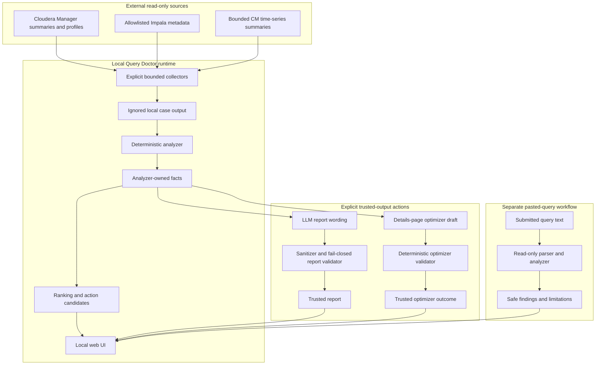
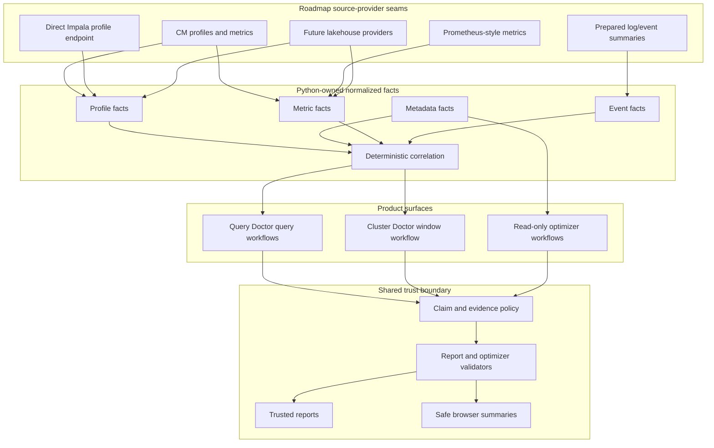

# Query Doctor Architecture

Language: English | [Russian](i18n/ru/architecture.md)

Query Doctor keeps fact extraction deterministic. LLMs may phrase the final
report narrative only from facts that Python has already extracted and
validated. English is the default trusted report language; Russian remains an
explicit localized output path.

## Current Architecture



Current implementation is intentionally narrow:

- Apache Impala is the only implemented query engine.
- Cloudera Manager summaries and profiles are the implemented profile source.
- CM time-series support is bounded and summarized before becoming facts.
- Impala metadata collection is explicit, read-only, and allowlisted.
- Reports and details-page optimizer drafts run only after an explicit
  selected-case action.
- The pasted-query optimizer is read-only, does not execute input, and does not
  echo submitted text after submit.

## Future Architecture

This diagram is a roadmap shape, not current support. Future providers and
workflows must first add contracts, fixtures, safety tests, and public docs
before they become product behavior.



Future direction:

- keep engine and provider adapters thin until there is implemented behavior;
- add direct Impala, Prometheus-style metrics, and prepared event providers only
  behind explicit bounded read-only contracts;
- keep Cluster Doctor as a separate user-run cluster/window diagnostic product,
  not an implicit query root-cause engine;
- let Python publish facts, statuses, confidence, limitations, and claim scope
  before any LLM wording is allowed;
- keep browser and report output raw-free across every future source.

## Current Pipeline

```text
Cloudera Manager profile summary
  -> query-doctor-collect-cm-profiles
  -> ignored local case directory
  -> query-doctor-analyze
  -> analyzer-owned facts artifact
  -> action cards and deterministic evidence
  -> optional bounded metadata context
  -> query-doctor-report
  -> sanitizer and fail-closed validator
  -> deterministic analyzer facts appendix
  -> trusted LLM report
  -> local UI
```

The implemented collection path is currently validated against the local
Cloudera Manager 6.2.1 environment. Treat newer Cloudera Manager versions and
non-Cloudera Impala deployments as future source-provider work, not as current
support.

The same boundary applies to every workflow: collectors and parsers prepare
bounded inputs, Python-owned analyzers create facts, LLMs phrase only trusted
facts, and validators decide what can be rendered or stored as trusted output.

## Components

### Collector

The collector:

- performs explicit, bounded, read-only profile collection from Cloudera
  Manager;
- requires redaction for real collection;
- keeps analyzer-useful counters and stable safe host aliases;
- writes generated local cases only under ignored corpus/output paths;
- does not run the analyzer or report writer.

Future profile acquisition should stay behind a small source-provider contract:
discover query summaries, fetch one explicit profile, fetch safe query context,
and fetch bounded runtime metrics when available.

Current provider support:

- Cloudera Manager API, tested against CM 6.2.1 behavior.

Planned provider seams:

- CM-version seam: isolate endpoint paths, response parsing, query-state
  normalization, and time-series tsquery allowlists so newer CM versions can be
  added with fixtures and safety tests instead of changing analyzer/UI
  contracts.
- Non-CM Impala seam: collect profiles directly from Impala daemon debug/profile
  endpoints for clusters without Cloudera Manager. This must stay explicit,
  bounded, read-only, redacted, and single-query oriented before any batch
  workflow uses it.
- Metrics seam: keep metrics source separate from profile source. Cloudera
  Manager time-series is the current implementation; Prometheus is the likely
  future metrics provider for non-CM clusters. Prometheus integration needs a
  bounded query allowlist, fixed time windows, response-size limits, and
  summarized facts only.

### Diagnostic Signal Seam

Profiles, metadata, metrics, and logs are separate diagnostic signal families.
Each family can have its own source providers and deterministic analyzer before
facts enter the shared report contract.

- Profile analyzer: implemented today for Impala runtime profiles.
- Metadata analyzer: implemented through bounded Impala metadata context.
- Metrics analyzer: partially started through bounded CM time-series summaries;
  future providers may read pre-aggregated metrics from CM/Prometheus or compute
  safe aggregates locally from bounded raw responses.
- Log analyzer: planned only. It should prefer prepared log indexes or
  structured log stores when available and fall back to bounded local parsing
  only with explicit allowlists, time windows, redaction, and tests.

Cross-signal correlation belongs in Python-owned facts, not in LLM inference.
The LLM may phrase a complex report only after profile, metrics, logs, and
metadata analyzers publish normalized facts with confidence/status fields.

Future Cluster Doctor work should follow
[cluster-doctor-contract.md](cluster-doctor-contract.md): keep it as a separate
explicit user-run read-only cluster/service/workload-window diagnostic seam, and
let Query Doctor consume only normalized Python-owned context or deterministic
correlation facts.

### Analyzer

The analyzer:

- reads the local collected profile digest;
- extracts deterministic facts into the analyzer facts artifact;
- writes operator summaries, anomaly counts, action cards, backend/host
  evidence, referenced tables, and optional table metadata facts when present;
- reads local metadata context when present and adds
  `## Table Metadata Context`;
- may later add safe metrics, event, or cluster facts only after source
  providers have bounded collection contracts and tests;
- does not call Cloudera Manager, the LLM runtime, or the report writer.

### Report Writer

The report writer:

- reads only the analyzer facts artifact;
- uses an LLM for narrative wording, not fact discovery;
- must not infer facts from raw profile text, SQL, local config, or external
  context;
- may eventually render a multi-signal diagnosis, but only from normalized
  Python-owned facts produced by profile, metadata, metrics, and log analyzers;
- generates trusted LLM reports within one fact boundary;
- requires localized user-facing narrative sections for summary,
  recommendations, detailed findings, and follow-up checks;
- deterministically appends a localized analyzer facts appendix from the facts
  artifact;
- excludes `## Table Metadata Context` and `## CM Time-Series Context` from the
  LLM prompt today;
- passes only curated metadata digest and normalized `## CM Metrics Facts` to
  the LLM;
- buffers raw LLM output and writes final reports only after normalization,
  sanitization, narrative validation, appendix append, and final validation.

### Sanitizer And Validator

The sanitizer and validator:

- normalize a narrow set of unsafe generated wording into explicit safe wording;
- reject reports with unsupported claims;
- fail closed: a rejected report is safer than accepted invented evidence;
- write only sanitized/normalized `.partial` output on validation failure and
  preserve the existing final report.

### Optimizer Draft Generator

The details-page optimizer:

- reads only server-owned analyzed case inputs;
- may use a read-only SELECT/WITH source or a SELECT/WITH payload extracted from
  supported INSERT/CTAS sources;
- uses the LLM for wording or SQL draft generation, while Python owns trust;
- never executes SQL;
- writes a validated draft only after read-only SQL validation and result-shape
  checks over physical tables, filter scope, projection, DISTINCT, top-level
  GROUP/ORDER/set operations, CTE names, and top-level join shape;
- classifies rewrite risk as `rewrite_allowed`, `conservative_rewrite`, or
  `recommendations_only`;
- may emit trusted non-SQL outcomes such as deterministic recommendations-only
  or `no_rewrite` when Python cannot trust a SQL draft or the draft has no
  material change;
- may expose external rewrite validation only after an LLM optimizer validation
  failure, and only as bounded in-memory validation against the server-owned
  source;
- keeps partial drafts untrusted and hidden from browser-visible details.

### Local UI

The local UI:

- exposes Finished Queries, Running Queries, Specific Query, details pages, and
  Query Optimizer workflows;
- discovers CM summaries first for Finished Queries, then collects bounded
  selected profiles, ranks deterministically, and leaves report/optimizer
  generation explicit per case;
- uses the same result shape for Running Queries;
- analyzes one known Query ID for Specific Query without automatic LLM and
  appends results to its table;
- parses one safe SELECT/WITH statement locally for Query Optimizer, does not
  execute pasted SQL, and does not render it back after submit;
- is not a source of facts;
- does not include broad unsafe collection or automatic web LLM batch reports.

See [roadmap.md](roadmap.md) for planned UI cleanup and architecture direction.
The current implementation remains Impala-only.

## Real-Case Coverage

Ignored local corpus and recent real-case checks cover important classes:

- `e94fbeb93feb2ad1_edd9d52c00000000`: host/backend data-skew evidence without
  proven execution-tail host.
- `fa469f95f6fb7286_ea9f070d00000000`: bad-query case with supported
  row/cardinality and memory estimate anomalies.
- Details-page optimizer smoke covers read-only SELECT/WITH sources,
  SELECT/WITH payload extraction from supported DML/CTAS, conservative rewrite
  mode, and validation rejection for unsafe result-shape changes.

Do not add raw SQL, raw hostnames, raw IP addresses, raw profiles, local config,
or credentials to committed docs.
