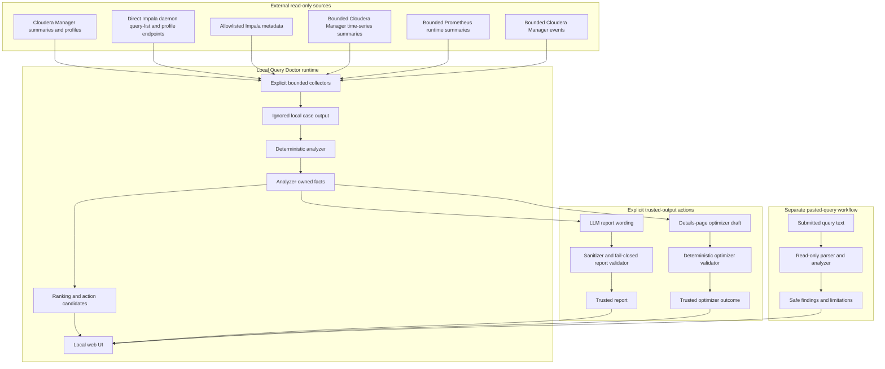
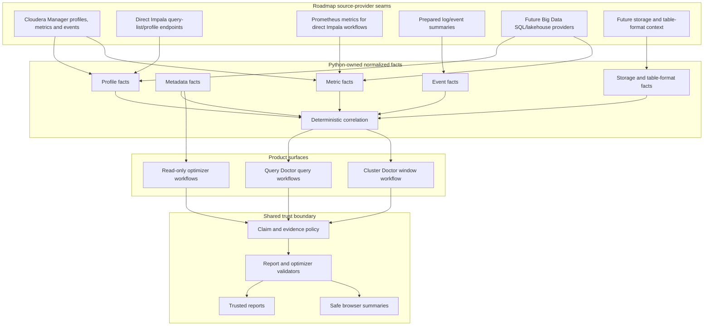
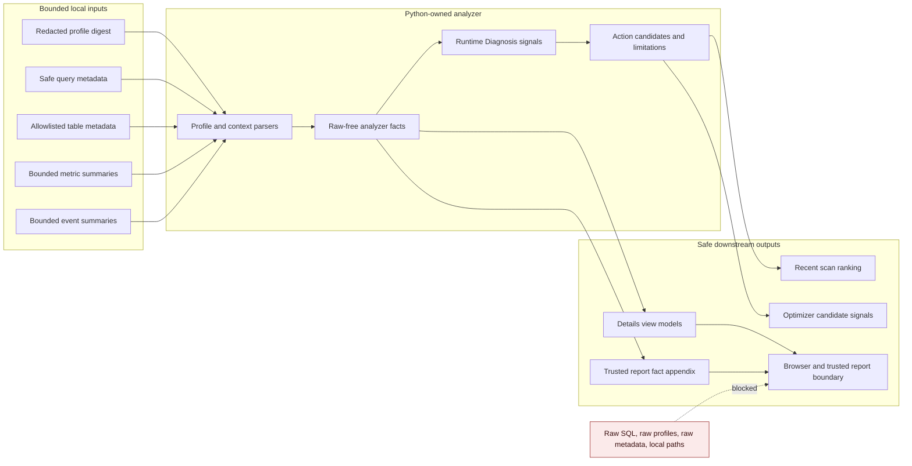

# Query Doctor Architecture

Last reviewed: 2026-05-22

Language: English | [Russian](i18n/ru/architecture.md)

Query Doctor keeps fact extraction deterministic. LLMs may write report wording
only from facts that Python has already extracted and validated. The global
`language` config controls Help, Details static UI copy, and newly generated
trusted reports; English is the default and Russian uses the same
language-specific prompt, normalizer, and validator boundary.

## Current Architecture



Current support is intentionally narrow:

- Apache Impala is the only implemented query engine.
- Cloudera Manager summaries, profiles, metrics, and events are the full
  implemented Recent queries source.
- Direct Impala daemon query-list and profile endpoints support bounded Recent
  scans, Running scans, and one explicit Known Query ID. They do not provide
  Cloudera Manager events; optional Prometheus runtime metrics can be collected
  only when explicitly configured.
- Direct Impala profile analysis publishes raw-free Profile Format, Source
  Provenance, Profile Resource Facts, and Profile Timing Facts.
- Cloudera Manager (CM) and Prometheus time-series support is bounded and
  summarized before becoming facts.
- Cloudera Manager events support is bounded and summarized before becoming
  Cluster Event Context.
- Impala metadata collection is explicit, read-only, and allowlisted.
- Reports and details-page optimizer drafts run only after an explicit
  selected-case action.
- The pasted-query optimizer is read-only, does not execute input, and does not
  echo submitted text after submit.

## Source-Provider Architecture

This diagram shows current and roadmap seams. Not every provider implements
every source family; future providers and workflows must first add contracts,
fixtures, safety tests, and public docs before they become product behavior.



Future direction:

- keep engine and provider adapters thin until there is implemented behavior;
- keep future engine work focused on Big Data SQL/lakehouse runtimes rather
  than generic OLTP database support;
- follow [engine-expansion-plan.md](engine-expansion-plan.md) for the transition
  order: Direct Impala profile source first, engine fact contract second, and a
  second engine only after demand and Impala readiness signals;
- treat query engine and storage/table-format context as orthogonal axes:
  engine adapters parse how a query ran, while storage context adapters publish
  bounded facts about HDFS, object storage, table formats or internal analytical
  storage;
- add direct Impala, Prometheus-style metrics, and prepared event providers only
  behind explicit bounded read-only contracts;
- keep Cluster Doctor as a separate user-run cluster/window diagnostic product,
  not an implicit query root-cause engine;
- let Python publish facts, statuses, confidence, limitations, and claim scope
  before any LLM wording is allowed;
- keep browser and report output raw-free across every future source.

## Current Pipeline

```text
Cloudera Manager profile summary
  -> query-doctor-collect-cm-profiles
  -> ignored local case directory
  -> query-doctor-analyze
  -> analyzer-owned facts artifact
  -> action cards and deterministic evidence
  -> optional bounded metadata collection and analyzer rerun
  -> query-doctor-report
  -> sanitizer and fail-closed validator
  -> deterministic analyzer facts appendix
  -> trusted LLM report
  -> local UI
```

The Cloudera Manager collection path is currently validated against the local
Cloudera Manager 6.2.1 environment. Direct Impala daemon collection is also
implemented for bounded Recent, Running, and Known Query ID workflows when
configured. Treat newer Cloudera Manager versions, broader non-Cloudera
provider behavior, and prepared event/log sources as future source-provider
work, not as automatic support.

The same boundary applies to every workflow: collectors and parsers prepare
bounded inputs, Python-owned analyzers create facts, LLMs phrase those facts
only after an explicit action, and validators decide what can be rendered or
stored as trusted output.

## Analyzer Flow

This is the contract-level analyzer flow. Individual Impala profile parsers,
metric adapters, event summarizers, and presenter helpers stay implementation
details so the diagram remains reviewable.



## Components

### Collector

The collector:

- performs explicit, bounded, read-only profile collection from Cloudera
  Manager or configured direct Impala daemon endpoints;
- requires redaction for real collection;
- keeps analyzer-useful counters and stable safe host aliases;
- writes generated local cases only under ignored corpus/output paths;
- does not run the analyzer or report writer.

Profile acquisition should stay behind small source interfaces rather than one
broad provider object: fetch explicit profiles and safe query context, discover
bounded query summaries, fetch bounded runtime metrics when available, and fetch
bounded event context when available.

Current provider support:

- Cloudera Manager API, tested against CM 6.2.1 behavior.
- Direct Impala daemon query-list/profile endpoints for bounded Recent,
  Running, and one explicit Known Query ID, with source provenance, resource
  facts, timing facts, and optional explicit Prometheus runtime metrics.

Provider seams:

- CM-version seam: isolate endpoint paths, response parsing, query-state
  normalization, and time-series tsquery allowlists so newer CM versions can be
  added with fixtures and safety tests instead of changing analyzer/UI
  contracts.
- Non-CM Impala seam: direct Impala daemon debug query-list/profile collection
  exists for bounded Recent, Running, and one explicit Known Query ID. It must
  stay explicit, bounded, read-only, redacted, and source-limited; follow-up
  work should improve fixtures, profile action cards, and normalized engine
  facts before broadening provider behavior.
- Metrics seam: keep metrics source separate from profile source. Cloudera
  Manager time-series is the full Cloudera Manager Recent scan implementation.
  Prometheus is an implemented optional metrics provider for configured direct
  Impala workflows. It uses a bounded query allowlist, fixed time windows,
  response-size limits, and summarized facts only.
- Events seam: keep Cloudera Manager events as the current event source for
  bounded cluster context. Future prepared log/event providers must publish
  normalized counts, categories, affected safe scopes and limitations, not raw
  log lines or raw provider payloads.

### Diagnostic Signal Seam

Profiles, metadata, metrics, events, and future logs are separate diagnostic
signal families. Each family can have its own source providers and
deterministic analyzer before facts enter the shared report contract.

- Profile analyzer: implemented today for Impala runtime profiles.
- Metadata analyzer: implemented through bounded Impala metadata context.
- Metrics analyzer: implemented through bounded CM time-series summaries;
  future providers may read pre-aggregated metrics from CM/Prometheus or compute
  safe aggregates locally from bounded raw responses.
- Event analyzer: started through bounded Cloudera Manager Events context.
  Future log analyzers should prefer prepared log indexes or structured log
  stores when available and fall back to bounded local parsing only with
  explicit allowlists, time windows, redaction, and tests.

Cross-signal correlation belongs in Python-owned facts, not in LLM inference.
The LLM may phrase a complex report only after profile, metadata, metrics,
events, and future log analyzers publish normalized facts with confidence/status
fields.

Future Cluster Doctor work should follow
[cluster-doctor-contract.md](cluster-doctor-contract.md): keep it as a separate
explicit user-run read-only cluster/service/workload-window diagnostic seam, and
let Query Doctor consume only normalized Python-owned context or deterministic
correlation facts.

### Analyzer

The analyzer:

- reads the local collected profile digest;
- extracts deterministic facts into the analyzer facts artifact;
- writes operator summaries, anomaly counts, action cards, backend/host
  evidence, referenced tables, and optional table metadata facts when present;
- reads local metadata context when present and adds
  `## Table Metadata Context`;
- may add safe metrics, event, or cluster facts only through bounded collection
  contracts and normalized analyzer facts;
- does not call Cloudera Manager, the LLM runtime, or the report writer.

### Report Writer

The report writer:

- reads only the analyzer facts artifact;
- uses an LLM for narrative wording, not fact discovery;
- must not infer facts from raw profile text, SQL, local config, or external
  context;
- may render a multi-signal diagnosis, but only from normalized Python-owned
  facts produced by profile, metadata, metrics, event, and future log analyzers;
- generates trusted LLM reports within one fact boundary;
- writes localized user-facing narrative sections for summary,
  recommendations, detailed findings, and follow-up checks;
- deterministically appends a localized analyzer facts appendix from the facts
  artifact;
- excludes raw metadata, raw time-series, and raw event context from the LLM
  prompt;
- passes only curated metadata digest, normalized `## Runtime Metrics Facts`, and
  bounded Cluster Event Context to the LLM/report boundary;
- buffers raw LLM output and writes final reports only after normalization,
  sanitization, narrative validation, appendix append, and final validation.

### Sanitizer And Validator

The sanitizer and validator:

- normalize a narrow set of unsafe generated wording into explicit safe wording;
- reject reports with unsupported claims;
- fail closed: a rejected report is safer than accepted invented evidence;
- write only sanitized/normalized `.partial` output on validation failure and
  preserve the existing final report.

### Optimizer Outcome Generator

The details-page optimizer:

- reads only server-owned analyzed case inputs;
- may use a read-only SELECT/WITH source or a SELECT/WITH payload extracted from
  supported INSERT/CTAS sources;
- uses Python-owned deterministic recipe executors for trusted SQL drafts;
- may use the LLM for explanation and recommendation wording, but not as the
  source of a trusted SQL draft;
- never executes SQL;
- writes a validated draft only after a supported recipe executor and
  read-only SQL validation prove result-shape checks over physical tables,
  filter scope, projection, DISTINCT, top-level GROUP/ORDER/set operations,
  CTE names, and top-level join shape;
- classifies rewrite risk as `rewrite_allowed`, `conservative_rewrite`, or
  `recommendations_only`;
- may emit trusted non-SQL outcomes such as deterministic recommendations-only
  or `no_rewrite` when Python cannot trust a SQL draft or the draft has no
  material change;
- may expose external rewrite validation only after an LLM optimizer validation
  failure, and only as bounded in-memory validation against the server-owned
  source;
- keeps partial drafts untrusted and hidden from browser-visible details.

### Local UI

The local UI:

- exposes Diagnose, details pages, Help, and explicit selected-case LLM action
  workflows;
- is implemented as server-rendered Python HTML with shared CSS and small
  vanilla JavaScript helpers; there is no JavaScript build pipeline or SPA
  framework in the current baseline;
- uses Recent queries as the default Diagnose mode, discovers Cloudera Manager
  summaries for Finished queries by default or direct Impala daemon query lists
  when configured, then collects bounded selected profiles, ranks
  deterministically, and leaves report/optimizer generation explicit per case;
- can collect bounded Cloudera Manager metrics/events or configured Prometheus
  runtime metrics as runtime context for selected cases;
- uses the same result shape for Running now scans, with lower-confidence live
  evidence;
- analyzes one known Query ID in the Known Query ID Diagnose mode without
  automatic LLM and appends results to its table. This path can collect via
  Cloudera Manager or direct Impala daemon profile endpoints, depending on
  local config;
- keeps the direct Query Optimizer route read-only for compatibility and safety
  testing; it parses one safe SELECT/WITH statement locally, does not execute
  pasted SQL, and does not render it back after submit;
- is not a source of facts;
- does not include broad unsafe collection or automatic web LLM batch reports.

Keep the server-rendered UI as the default architecture. It matches the
local-first workflow and keeps Python presenters close to the browser safety
boundary. A React or other client-app migration is not a goal by itself. Treat it
as future work only when a specific surface needs substantial client-side state,
such as complex in-browser filtering, multi-job live progress, graph/timeline
visualization, comparison workflows, or a richer optimizer editor. Any such
migration must first define narrow safe JSON/view-model contracts, preserve the
raw-free browser boundary, add focused browser-safety tests, and justify the new
Node/build dependency in the dependency policy.

See [roadmap.md](roadmap.md) for planned UI cleanup and architecture direction.
The current implementation remains Impala-only.

## Real-Case Coverage

Ignored local corpus and recent real-case checks cover important classes:

- `e94fbeb93feb2ad1_edd9d52c00000000`: host/backend data-skew evidence without
  proven execution-tail host.
- `fa469f95f6fb7286_ea9f070d00000000`: bad-query case with supported
  row/cardinality and memory estimate anomalies.
- Details-page optimizer smoke covers read-only SELECT/WITH sources,
  SELECT/WITH payload extraction from supported DML/CTAS, conservative rewrite
  mode, and validation rejection for unsafe result-shape changes.

Do not add raw SQL, raw hostnames, raw IP addresses, raw profiles, local config,
or credentials to committed docs.
